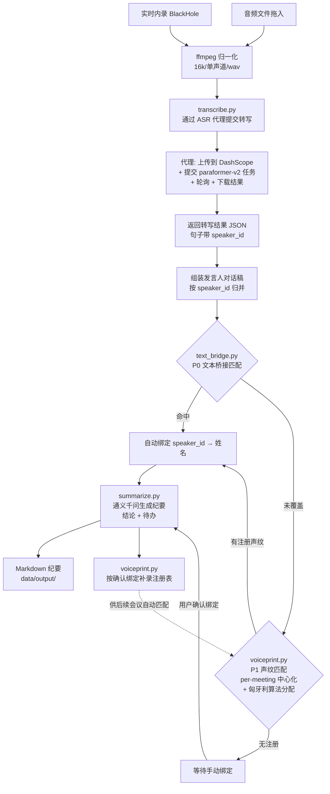

# ARCHITECTURE — 系统架构

> 本文是架构的**唯一事实源**。改架构先改这里，再改代码。API 细节见 [API_CONTRACTS.md](API_CONTRACTS.md)，决策来由见 [adr/](adr/)，云部署运维见 [DEPLOYMENT.md](DEPLOYMENT.md)。

## 一、分层与职责

| 层 | 模块 | 职责 |
|----|------|------|
| 采集 | `core/audio.py` `core/audio_recording.py` | ffmpeg 归一化（16k/单声道/wav）；BlackHole 内录采集（avfoundation）；流式录音（PCM pipe）；录音会话管理 |
| 上云 | `core/upload.py` | 本地文件 → DashScope 免费临时存储 → `oss://` 临时 URL |
| 转写 | `core/transcribe.py` | 通过 ASR 代理提交转写（代理负责上传 + 提交 + 轮询 + 下载）+ 碎片合并/说话人修正 + 组装发言人对话稿 |
| 实时转写 | `core/realtime_asr.py` | 通过 ASR 代理 WebSocket 中继的 `qwen-audio-3.0-asr-flash-streaming` 流式客户端，支持热词/上下文增强 |
| 实时分离 | `core/diarization.py` | CAM++ 192维声纹嵌入 + VAD 能量检测 + 余弦相似度贪心聚类，MFCC 降级 |
| 实时章节 | `core/realtime_chapters.py` `core/chapters.py` | 录音中按话题切分章节 + 批处理章节生成 |
| 实时总结 | `core/realtime_summary.py` | 基于 `qwen-turbo` 的增量式定时总结（每 60 秒触发） |
| 热词 | `core/hotwords.py` | `data/hotwords.txt` → DashScope 热词表 `vocabulary_id`；热词映射后处理纠正 |
| 纪要 | `core/llm.py` `core/summarize.py` | 通义千问 provider（同步/异步/流式，含事件循环防护三层架构）+ 纪要提示词与解析（结论/决策）+ 标题生成 |
| 声纹 | `core/voiceprint.py` | CAM++ 神经声纹嵌入提取（192 维，中文语料训练）+ 声纹注册表（时长加权累积）+ per-meeting 中心化 + 匈牙利算法一对一分配 |
| 文本桥接 | `core/text_bridge.py` | 实时绑定文本 → 批处理结果的模糊匹配（`difflib.SequenceMatcher`），按命中次数投票确定 speaker_id，实现 P0 分层匹配策略 |
| 嵌入提供者 | `core/embedding_provider.py` | 声纹嵌入提取抽象层：`EmbeddingProvider` 接口 + `CloudEmbeddingProvider`（HTTP）/ `MfccFallbackProvider`（14 维降级）；通过 `get_embedding_provider()` 按配置选择（v5 云端拆分后已移除本地 CAM++ 提供者） |
| 说话人 | `core/speakers.py` | 说话人档案 CRUD + 会议级映射 + 姓名应用 |
| 项目 | `core/projects.py` | 项目（文件夹分组）管理 + 文件索引扫描 + 纪要归档同步 |
| 用户 | `core/users.py` | 本地用户 + OAuth 用户 + 说话人绑定 + 请求级 ContextVar 身份隔离 + 声纹偏好（订阅状态驱动） |
| 版本检查 | `core/version_check.py` | 读取 VERSION、调用 GitHub Releases API、语义化版本比对、30 分钟缓存、网络失败静默降级 |
| 认证 | `core/auth.py` | GitHub OAuth 2.0 提供者 + JWT 签发/验证 + CSRF state 管理 |
| 错误处理 | `core/errors.py` | 瞬时错误判断 + 错误分类（供自动重试与前端展示），错误建议支持 i18n 多语言 |
| 国际化 | `core/i18n/` | Babel + gettext 后端多语言：I18nMiddleware（语言偏好解析，写入 ContextVar）+ get_translator()（lru_cache）+ _() 翻译函数（ContextVar 驱动，请求级 locale，深层调用栈无需传 request）；翻译文件 `locales/{zh_CN,en}/LC_MESSAGES/`（.po+.mo）；工作流 `pybabel extract` → `scripts/gen_i18n_po.py` → `pybabel compile`；详见 [ADR-0013](adr/0013-国际化i18n架构.md) |
| 作业日志 | `core/joblog.py` | per-task 操作/运行事件流（append-only JSONL）；为会议助手提供渐进式上下文 |
| 翻译 | `core/translate.py` | 文本翻译 |
| Agent | `core/agent_workspace.py` `core/agent_tools/` | Agent 角色工作区管理（角色加载/fork/切换）+ 会议域工具唯一实现与 MCP 反向桥工具面（自建 ReAct 循环已退役，见 ADR-0020） |
| 对话引擎 | `core/chat_actions.py` `core/chat_context.py` `core/chat_edits.py` | AI 对话动作检测与执行 + 对话上下文构建 + 对话编辑管理 |
| 云端客户端 | `core/cloud_client.py` | 云端 API 客户端（HMAC-SHA256 签名认证） |
| 洞察 | `core/insights.py` | AI 洞察提取（会议上下文分析） |
| 计量 | `core/metering.py` | 用量计量与配额管理 |
| 静默检测 | `core/silence_detection.py` | 录音静默段检测与告警 |
| 说话人估算 | `core/speaker_count.py` | 说话人数量自动估算 |
| 项目索引 | `core/project_index.py` | 项目文件索引扫描（支持关键词检索） |
| 远程配置 | `core/remote_config.py` | 远程配置/公告消息/全局 feature flags 管理 |
| 管线执行器 | `core/pipeline_runner.py` | 后台管线执行器（含自动重试 + 错误分类 + i18n 建议） |
| 声纹辅助 | `core/voiceprint_identify.py` `core/voiceprint_registry.py` | 声纹自动识别 + 声纹注册表持久化管理 |
| 聚类 | `core/diarization_cluster.py` | 在线说话人聚类算法 |
| 编排 | `core/pipeline.py` | 串联全流程（stage1: 转写, stage2: 纪要），输出 Markdown |
| 界面 | `app/server.py` | FastAPI 本地服务 + 安全审计中间件 + 全局异常处理 |
| 设置存储 | `app/settings_store.py` | 三层配置加载（settings.json + 环境变量 + 远程配置）+ 原子持久化 |
| 前端 | `frontend/` | Vue 3 + TypeScript + Vite + Pinia 单页应用（详见下方「前端架构」节） |
| 路由 | `app/routers/` | 21 个功能域路由模块（tasks/record/chat/speakers/voiceprint/hotwords/notes/projects/settings/user/philosophy/auth/usage/config/update/agent/cloud_api/insights/admin/admin_config/ws_transcript） |
| 共享状态 | `app/store.py` | 跨路由共享状态（tasks 字典、实时状态）、配置常量、持久化辅助、后台管线函数 |
| 入口 | `cli.py` `desktop.py` | 命令行（含 `build`/`server` 命令）+ 桌面客户端入口（pywebview 原生窗口） |

### 前端架构（v2.0）

```
frontend/src/
├── api/          18 个模块（types + client + tasks + auth + notes + record + projects + speakers + hotwords + settings + chat + agent + announcements + insights + storage + update + usage + voiceprint）
├── stores/        9 个 Pinia store（theme + task + user + agent + aiSessions + layout + player + realtime + watermark）
├── composables/  35 个可复用逻辑（AI 系列 6 个 + 功能类 29 个，详见 VUE_COMPONENT_MAP.md）
├── views/         9 个页面视图（Start + Recording + Generating + Library + Projects + Speakers + Hotwords + Agents + Settings）+ generating/recording 子视图
├── components/    通用组件 8 个（common/5 + InlineEditInput + MdBlockEditor + SelectionToolbar）+ 子域组件（layout/6 + modals/1 + task/3 + chat/ + notes/ + transcript/）
├── styles/       10 主题 + 19 个模块化 CSS 文件（base + layout + topbar + sidebar + ai-panel + components + recording-view + speakers + notes-editor + auth + update-panel 等）
├── i18n/          国际化模块（vue-i18n v11 实例 + 2 语言异步加载 + setI18nLocale 切换 + tt() 供非组件 TS 用）
├── router/        Vue Router（9 路由，懒加载）
├── main.ts        应用入口
└── App.vue        根组件（三栏布局）
```

- 开发模式：`cd frontend && npm run dev`（Vite :5173，代理 API 到 :8000）
- 生产模式：`python cli.py build` → `python cli.py server`（FastAPI 托管 `frontend/dist/`）
- 兼容模式：若 `frontend/dist/` 不存在，自动回退到旧版 `app/static/index.html`
- 组件详细映射见 [VUE_COMPONENT_MAP.md](VUE_COMPONENT_MAP.md)

## 二、数据流



## 三、关键设计约束（详见 API_CONTRACTS）
1. **只认公网 URL**：本地/内录文件必须先上传换 `oss://` URL。
2. **`oss://` 走 RESTful**：转写调用用 `requests`，加 `X-DashScope-OssResourceResolve: enable`；不用 SDK。
3. **分离仅单声道**：ffmpeg 归一化阶段强制下混单声道，否则无 `speaker_id`。
4. **异步**：提交 → 轮询 → 下载，UI 需体现排队/进度。
5. **体积**：临时存储 ≤1GB / 48h；16k 单声道 wav ≈ 115MB/小时，常规会议足够；超长会议分段或自建 OSS。

## 四、边界与非目标（v1）
- **不做**本地 ASR / 本地分离 / 本地 LLM（v2 再议）。
- **声纹姓名化已实现（v4）**：通过 CAM++ 本地提取 192 维声纹嵌入（基于 FunASR CAMPPlus 实现，权重来自 ModelScope `iic/speech_campplus_sv_zh-cn_16k-common`，中文语料训练，对中文说话人判别力显著优于旧版 GE2E），注册后自动匹配，降级为手动绑定；绑定确认后后台按映射自动注册声纹（`register_from_binding`）形成闭环，重复注册按时长加权累积（`total_sample_duration` 字段）。每条注册记录带 `model_version`（当前 `cam++-v1`），encoder 升级时旧版本记录在匹配侧被自动忽略，需通过 rebuild 端点重新注册。匹配直接在 L2 归一化后的余弦空间进行（CAM++ 本身已具备足够判别力，不再需要 cohort centering 补丁）；注册与匹配共用单人音频时长上限（`MAX_SEC_PER_SPEAKER`）以保证嵌入可比。注册表为空或无当前 encoder 版本记录时跳过自动匹配；绑定页对未命中说话人仅以“上次会议映射”补填建议并提示需人工核对（speaker_id 跨会议不稳定）。
- **v3++ 分层匹配策略**：批处理完成后按 P0 文本桥接（`core/text_bridge.py`，确定性证据）→ P1 声纹匹配（概率性证据）→ P2 手动绑定的优先级依次执行。文本桥接利用实时阶段已绑定说话人的文本片段，在批处理结果中搜索相似文本，直接继承绑定关系。声纹匹配仅补充文本桥接未覆盖的 speaker_id。匹配成功后自动更新声纹注册表（含时长加权）。
- **人员独立于会议记录**：声纹注册/更新不绑定单个录音文件。`POST /api/voiceprint/rebuild/{speaker_uuid}` 按 `speaker_uuid_mapping` 反查该说话人参与的所有已完成会议，逐场提取其发言片段嵌入后均值融合覆盖注册表（`sample_count` = 会议数），抑制单场录音的信道偏置；说话人详情页「注册/更新声纹」按钮即调用此端点。
- **作业日志从属于会议纪要**：`core/joblog.py` 以 task_id 为键，用 append-only JSONL（`data/tasks/{id}.joblog.jsonl`）记录录音/转写/声纹匹配/绑定/纪要生成/助手动作的关键操作与运行事件。会议助手针对某会议提问时，仅当问题涉及操作/运行/流程/故障（意图关键词门控）才**渐进式**注入上下文：先轻量概要（阶段计数 + 最近事件），再按问题检索相关明细，避免全量日志塞入提示词。作业日志写入失败静默降级，绝不打断主链路。
- **一个厂商一套 key**：ASR 与纪要都用 DashScope，简化凭据管理。

## 五、依赖
- 运行依赖：`requests`、`httpx`、`fastapi`、`uvicorn`、`python-dotenv`、`dashscope`、`websockets`、`python-multipart`、`numpy`、`scipy`
- 认证依赖：`PyJWT`（JWT 签发/验证）
- 项目关联：`python-docx`、`PyPDF2`（文档文本提取）
- 外部：ffmpeg（已装 8.1）、BlackHole 2ch（已装）、DashScope 服务（已验证可达）
- 子服务依赖：`voiceprint-service/` 需要 `torch` + `torchaudio`（CAM++ 编码器，CPU-only）；`asr-proxy/` 和 `sms-proxy/` 各自独立 requirements
- 主项目无需：torch、FunASR、pyannote、Ollama、HuggingFace、resemblyzer
