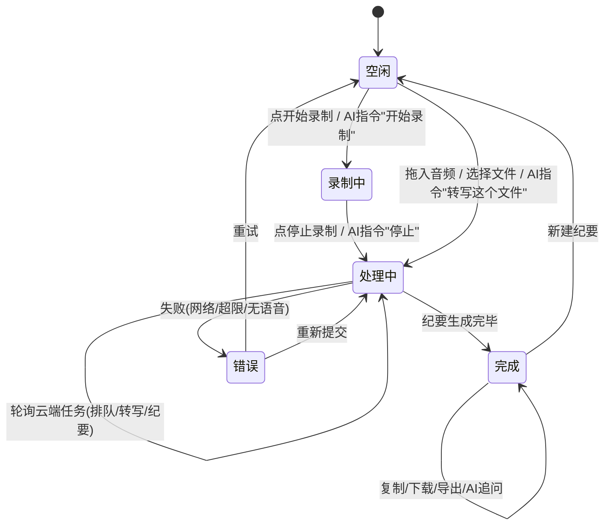

# 界面设计决策

> 本文记录界面设计中的**决策与原则**——那些代码里读不出来的「为什么」。
> 具体组件实现（按钮、布局、字段）请直接阅读 Vue 源码（`frontend/src/views/` + `frontend/src/components/`）。
> 可视化原型线框存于 `wireframes/`。
> 图标规范见 [`ICON_SPEC.md`](../ICON_SPEC.md)。

## 1. 全局布局原则

**左中右三栏结构**：侧边栏（导航）+ 主工作区（弹性）+ AI 助手面板。

**顶栏遵循「标题、状态与视图」原则**：顶栏不放置功能入口（说话人、设置等迁移至左栏底部），只展示当前上下文和视图切换控制。**顶栏也不叠加录音中胶囊**——录音态由页面自身头部与控制栏承载（`recording` 路由），或由右上角 `.rec-pill` 在非会议页承载；顶栏左侧状态胶囊仅显示非录音态任务状态（转写中/总结中/已完成等）。

**面板显隐统一由顶栏视图切换与缝隙拉手控制**；分隔缝（`.layout-divider`）为纯视觉元素，不承载任何交互。

**系统消息横幅参与 grid 布局**：`reg-guidance-banner` 放在 `.frame` grid 内部（`auto auto 1fr 28px` 的第一行），而非外部。子视图（`.gen-view`、`.rec-main`）使用 `height: 100%` 继承可用空间，不使用硬编码 `calc(100vh - ...)`，确保横幅显隐不影响整体布局完整性。

**侧边栏窄幅态自适应**：侧边栏通过 `ResizeObserver` 监听宽度变化，当 < 200px 时自动进入窄幅态（`.is-narrow`）。此时任务列表标题从两行截断切换为单行省略号（`text-overflow: ellipsis`），时长信息隐藏，保持列表项高度一致与视觉节奏稳定；完整标题仍可通过悬停卡片查看。此设计避免拖拽收窄时文字大量换行造成的空白与混乱。

## 2. 状态机



## 3. 响应式策略

| 断点 | 行为 |
|------|------|
| ≤1200px | 隐藏右侧 AI 面板及其分隔条 |
| ≤800px | 默认隐藏左侧导航栏；录音视图的实时转写/实时总结切换为 Tab 模式 |

**缝隙拉手交互**：
- 点击（水平位移 ≤4px）= 折叠/展开；按住水平拖动 = 调整面板宽度（左栏 140–400px，右栏 240–600px），宽度记忆在 localStorage
- 折叠态只响应点击展开，不响应拖拽调宽
- 分隔缝（`.layout-divider`）为纯视觉元素：不响应 hover、不响应拖拽，仅在拖拽调宽过程中高亮缝线作为反馈

**录音视图 Tab 模式**（≤800px）：
- 实时转写与实时总结不再并行显示，改为顶部 Tab 切换
- 默认展示「实时转写」Tab，可手动切换到「实时总结」
- 恢复宽屏时自动回到并行布局

## 4. 录音视图 · 时间戳打点笔记

笔记融入转写流的设计决策：

- **全宽输入栏**（横跨转写 + 总结下方，控制栏上方）：始终可见，Enter 发送，Shift+Enter 换行
- **笔记融入转写流**：笔记直接插入转写时间线中时间最近的对话条目之后，与对话共享同一滚动区域
- **靠右轻量气泡**：笔记为靠右对齐的气泡卡片（max-width 78%），冷色调（`--note-bg`），带 ✏️「笔记」标签 + 时间戳
- **与「我说的」区分**：绑定为「我」的说话人段落为暖绿色底（`--mine-bg`）+ 全宽形态；笔记为冷蓝色 + 气泡形态 + 笔记标签——形态差异优先于颜色差异
- **显示标记**（toggle 开关）：开启后仅当转写区溢出时，无笔记对话组自动压缩为「已折叠 N 段对话」
- **删除确认**：点击叉号后气泡内变为「确认删除？删除 取消」，二次确认防误操作
- **持久化**：笔记数据实时写入 localStorage，刷新页面不丢失；停止录音时格式化提交后端
- **可访问性**：textarea 关联 sr-only label；计数徽章 `role="status"`；发送/删除按钮 `aria-label`；焦点环全覆盖；`prefers-reduced-motion` 适配

## 5. AI 对话设计

### 5.1 产品定位

AI 对话是本产品的**核心差异化功能**，而非附加组件：

| 阶段 | AI 能力 |
|------|---------|
| v1 (MVP) | 基础对话：驱动录音/转写/纪要，查询历史，简单设置 |
| v2 | 深度集成：声纹识别后自动关联发言人身份，智能追问 |
| v3 | 主动助手：会前准备提醒，会中实时摘要，会后待办跟踪 |

### 5.2 交互原则

- 支持自然语言输入，不强制命令格式
- 关键操作需二次确认（如删除、覆盖）
- 操作结果以卡片形式内嵌对话流
- 长回复支持折叠
- **操作结果系统校验（ADR-0008）**：AI 无执行权，数据修改由后端执行并磁盘回读校验；回复尾部追加系统生成的校验结论块；有校验变更时待办 Tab 与任务缓存自动刷新

### 5.3 快捷操作菜单

配置化架构（`AI_QUICK_ACTIONS`），预置：麦克风录音、上传文件、历史会议、热词管理。录音中时「麦克风录音」自动切换为「停止录音」并高亮显示。

## 6. 设计范式 · 菜单克制，内容优先

会议纪要等内容消费页面的顶部菜单应保持克制，**更多信息留给内容而不是功能**。

| 原则 | 说明 |
|------|------|
| 高频才上菜单 | 菜单栏只保留用户每次都会用到的操作（如复制、下载），低频功能下沉到右键菜单或设置页 |
| 内容区域优先 | 用户打开页面是为了阅读内容，不是为了点按钮；内容区域应占据最大视觉权重 |
| 减少视觉噪声 | 每多一个按钮就多一分干扰；控件越少，内容越突出 |
| 渐进披露 | 高级操作通过 `⋯` 更多菜单或右键菜单按需展开，不一次性铺满 |

> 这是软件的设计范式，适用于所有以内容消费为主的页面。

## 7. 说话人显示统一标准

所有涉及说话人标识的位置（转写行、绑定栏、说话人面板、管理页、聚焦模式、引导弹窗等）遵循同一套视觉规则：

| 元素 | 规则 | 原因 |
|------|------|------|
| 说话人名称 | **字体颜色区分**（使用 `getSpeakerColor()` 返回的 OKLCH 色值） | 颜色直接附着于文字，无需额外符号承载 |
| 彩色圆点 | **不使用** | 字体颜色已能区分，圆点冗余 |
| 发言占比 | **横条图形**（名称下方 48×3px 圆角条，宽度 = 占比百分比） | 数字百分比信息密度过高，横条提供直觉式「大概占比」 |
| 堆叠色条 | **不使用**（原元信息行的整体色条已移除） | 各行内横条已足够表达占比 |

### 适用范围

- 转写行说话人标签（RecordingView / GeneratingView）
- 元信息行说话人标签（GeneratingView 顶部）
- 绑定栏图例标签（GeneratingView binding bar）
- 绑定下拉框选项（GeneratingView dropdown / RecordingView popover）
- 右侧说话人面板列表项（GeneratingView speaker panel）
- 聚焦模式横幅（solo banner）
- 说话人管理页列表与详情（SpeakersView）
- 引导弹窗示例（onboarding modal）

### 不适用的场景

- 顶栏说话人计数徽章（`sc-dot`）：这是状态指示器（「有 N 位说话人」），不是说话人标识

### 绑定栏显示时机（2026-09-10 更新）

纪要生成不再以说话人绑定确认为前提：转写完成后管线直接跑 Stage 2（无自动匹配时纪要先以通用说话人标签生成）。绑定栏（GeneratingView `.gen-binding-bar`）的显示条件由「任务状态为 `awaiting_mapping`」改为「**存在未关联说话人且转写已完成**（`completed`；`awaiting_mapping` 为历史遗留状态）」：

- 未关联说话人存在期间，绑定栏与原文可绑定标签始终保留，供事后关联身份；
- 点击「确认关联」提交映射并按真实身份重新生成纪要；全部关联后绑定栏自然结束；
- 「暂不关联」按任务级持久隐藏绑定栏（localStorage `oms_bind_bar_dismissed:<taskId>`）；关闭按钮（×）仅会话级隐藏。

## 8. 交互规范 · 弹出菜单（PopMenu）统一标准

适用于一切"点按钮弹出小面板"的场景：更多菜单、绑定下拉、Tab 下拉、日期选择、主题切换、悬浮卡片等。**禁止为新按钮手写定位与关闭逻辑**，一律复用 `usePopMenu` 组合式函数（`frontend/src/composables/usePopMenu.ts`）。

### 8.1 行为四原则

| 原则 | 要求 |
|------|------|
| 禁止溢出视口 | 菜单任意边缘不得超出软件视口。底部空间不足自动向上翻转；左右溢出自动回缩；与视口边缘保持 ≥8px 间距。与触发按钮在页面哪个位置无关 |
| 图层优先 | 弹层 `z-index` 只允许引用分层 token（见 8.2），禁止自造数值 |
| 点击空白关闭 | 菜单打开期间，点击菜单与触发按钮以外任何区域自动关闭 |
| Esc 关闭 | 按 Esc 键立即关闭 |

补充行为：菜单打开期间窗口滚动 / 缩放时自动重新定位，始终跟随触发按钮；定位测量使用 `requestAnimationFrame`（`nextTick` 不等浏览器布局，`offsetHeight` 可能为 0，曾导致菜单始终向下弹出溢出屏幕的缺陷）。

### 8.2 图层阶梯（z-index token）

| Token | 值 | 用途 |
|-------|-----|------|
| 内容 / 吸附 | 0–20 | 页面内容、sticky 表头、局部悬浮按钮（直接写数值） |
| `--z-topbar` | 100 | 顶栏 |
| `--z-popover` | 500 | 一切弹出层：更多菜单、下拉、气泡、悬浮卡片、选择操作条 |
| `--z-modal` | 1000 | 模态遮罩、对话框、向导 |
| `--z-toast` | 1100 | 全局提示、登录遮罩、无障碍跳转链接 |

定义于 `legacy-views.css` 的 `:root`。新增浮层时先判断属于哪一层，再引用 token；层级冲突时以上表为准调整元素归属层，而非加大数值。

### 8.3 代码构成与用法

```ts
const menuEl = ref<HTMLElement | null>(null)
const btnEl = ref<HTMLElement | null>(null)
// 解构后模板中自动解包：visible / toggle / close
const { visible, toggle, close } = usePopMenu(menuEl, btnEl, { align: 'end' })
```

```html
<button ref="btnEl" @click="toggle" aria-haspopup="menu" aria-label="更多">…</button>
<div ref="menuEl" class="pop-menu" :class="{ 'is-open': visible }" role="menu">…</div>
```

- 默认 `align: 'end'`（右对齐触发按钮，更多按钮惯例）；`align: 'start'` 用于左对齐场景。
- 菜单项点击后必须调用 `close()`（或在 handler 首行关闭），菜单不自动关闭。
- 打开状态类名为 `is-open`，控制 `display: none → block`。
- 触发按钮必须带 `aria-haspopup="menu"` 与明确的 `aria-label`。

### 8.4 禁止事项

- 禁止绕过 `usePopMenu` 手写 `position: fixed` 定位计算。
- 禁止在组件 `<style scoped>` 或工具类中为弹层写死 `z-index` 数值。
- 禁止只处理"向下弹出"而不检测视口边界。
- 禁止遗漏点击空白关闭（菜单打开后遮住内容却无法点掉，等于功能故障）。

### 8.5 交互规范 · 选择类弹层（DropdownPopup）统一标准

来源：2026-09-24 用户反馈 C1（点击其他区域弹窗不收起）、C2（检索后方向键无法导航候选项）。

`usePopMenu` 服务 **动作菜单**（role="menu"，自带定位）；一切 **选择类弹层**（从候选列表中挑一项：知识库关联下拉、项目下拉、说话人绑定弹窗、参会人下拉等，通常带检索输入框）统一复用 `useDropdownPopup`（`frontend/src/composables/useDropdownPopup.ts`），它不接管定位（选择类弹层多为触发元素下方的绝对定位容器）。

| 原则 | 要求 |
|------|------|
| 点击外部关闭 | 弹层与触发元素以外的点击自动关闭；同一时刻只允许一个选择类弹层打开 |
| 键盘导航 | ↑↓ 循环高亮候选项，Enter 激活高亮项（无高亮时激活第一项），Esc 关闭 |
| 焦点保持在检索框 | 高亮用 class（`is-nav-active`）而非焦点迁移；弹层内非输入元素 `mousedown` 不抢焦点；检索过滤后无需重新聚焦 |
| 过滤自适应 | 候选项被检索过滤后高亮索引自动失效重算（按键时对活 DOM 重新校验） |

接入约定：

- 弹层容器绑定 `root` ref，候选项统一加 `data-dd-item` 属性；高亮样式为全局 `[data-dd-item].is-nav-active`（`shared-list.css`）。
- 自带 Enter 语义的输入框（如就地新建）加 `data-dd-enter="native"`，composable 不劫持其 Enter。
- 已有完整自有键盘导航的弹层（如参会人下拉的 `onRosterKeydown`、说话人绑定下拉的 `onDropdownKeydown`）传 `keyboard: false`，仅补点击外部关闭与焦点保持，避免双重导航。
- 状态仍由消费方持有（`isOpen` getter + `close` 回调），composable 只附加行为规范。

已接入：知识库关联下拉（GeneratingView）、录音页项目下拉与参会人下拉（RecControlBar）、录音页说话人绑定弹窗（RecSpeakerBind）。**新增选择类弹层禁止手写 document 点击监听与键盘导航**，一律走 `useDropdownPopup`。

## 9. 交互规范 · 控件作用域与显隐开关

### 9.1 控件作用域 = 影响范围

| 原则 | 要求 |
|------|------|
| 局部控件不上全局栏 | 只影响某一个 Tab 内容的控件，必须只在该 Tab 激活时出现；不得常驻控制区，否则用户在其他 Tab 上会误以为它作用于当前内容 |
| 全局控件才常驻 | 音频播放条这类跨 Tab 生效的控件保持常驻 |
| 作用域内不越界 | 显隐开关只作用于它所声明的对象（如"转写原文"只作用于原文行），同一容器内的其他内容（AI 章节卡片、要点、导航条）不受影响 |

### 9.2 隐藏 / 显示类开关必须自解释

隐藏内容是高认知成本操作：用户看到内容消失，第一反应是"数据没了"。因此这类开关必须同时满足三条：

| 要素 | 规则 | 反例 |
|------|------|------|
| 动词文案 | 按钮文字说明点击后的结果，随状态切换（`隐藏原文` ↔ `显示原文`） | 静态名词标签「转写原文」——无法判断当前是开还是关 |
| 状态图标 | Lucide `eye`（显示中）/ `eye-off`（已隐藏），与文案同步翻转 | 图标语义与状态相反 |
| 就地提示条 | 内容被隐藏后，在原内容位置显示提示条：`已隐藏 N 条转写原文，当前仅显示章节与要点` + 「显示原文」快捷按钮 | 只留空白区域，用户无从得知如何恢复 |
| 方向箭头 | 带折叠/展开方向的控件，箭头指向**动作方向**（面板将要移动的方向）：展开态显示 `›`（向右收起）、折叠态显示 `‹`（向左展开） | 以状态为方向：展开态显示 `‹`，箭头与点击结果指向相反 |

### 9.3 适用范围

- 纪要页转写原文开关（`GeneratingView.vue` `.transcript-toggle` + `.gen-hidden-indicator`）
- 录音页转写原文开关（`RecordingView.vue` `.btn-translate` + `.rec-hidden-indicator`）
- 录音页标记模式压缩（`.rec-marker-compressed`）
- AI 助手栏折叠/展开（`AIPanel.vue` `.ai-toggle`）：缝隙居中胶囊拉手 + 动作方向箭头 + 随状态切换的 tooltip
- 今后任何"隐藏部分内容"的开关

### 9.4 禁止事项

- 禁止用静态名词作为显隐开关的文案。
- 禁止隐藏内容后不提供任何就地恢复入口。
- 禁止把 `v-show` 加在混合容器上（容器内既有目标内容又有不该被隐藏的内容）——必须下移到目标元素本身。
- 禁止以「当前状态」作为折叠/展开控件的箭头方向——箭头必须指向点击后的动作方向。

### 9.5 缝隙拉手双手势标准（分隔缝纯视觉）

每条面板缝隙只有一个交互入口——缝隙拉手；分隔缝（`.layout-divider`）为纯视觉元素，不响应任何鼠标事件：

| 规则 | 说明 |
|------|------|
| 双手势 | 拉手点击（水平位移 ≤4px）= 折叠/展开；按住水平拖动 = 调整宽度 |
| 全拉手可拖 | 拉手 18×56 横跨缝隙两侧各 9px，其范围内任意位置按下均可起拖，无死区；拉手之外的分隔缝区域不可交互 |
| 折叠态 | 只响应点击展开，不响应拖拽调宽（折叠态无宽度语义） |
| 状态共享 | 两侧拉手共用同一宽度 clamp 与持久化键（`oms_sb_width` / `oms_ai_width`），统一走 `beginResize` 入口 |
| 层叠 | 面板需显式 `z-index` 高于分隔缝：`contain` 会建立独立层叠上下文困住拉手的 z-index，不显式抬升会导致缝线反压在拉手上 |
| 拖拽反馈 | 拖拽调宽过程中缝线加粗高亮（`body.is-divider-dragging .divider-line`），作为唯一的分隔缝动态反馈 |

适用范围：左侧边栏 `.sb-toggle`、右侧助手栏 `.ai-toggle`；两条 `.layout-divider` 仅保留 `.divider-line` 子元素。

禁止：在拉手之外为同一缝隙再设独立的折叠或调宽入口（如头部折叠按钮、浮动展开按钮、可拖拽分隔条）。

## 10. 交互规范 · 按钮文本与工具提示（不可变更原则）

> 本条为**不可变更原则**——所有功能按钮必须遵循，无例外。

### 10.1 核心原则：按钮必有文本定义

每个功能按钮都必须有一个明确的文本名称，用于描述该按钮的功能。文本名称是按钮的**身份标识**，不可省略。

| 状态 | 行为 |
|------|------|
| 按钮可见时 | 文本名称必须与图标/按钮一同显示 |
| 图标-only 状态时 | 鼠标悬停必须通过 tooltip 展示文本名称 |

### 10.2 两种显示模式

#### 模式 A：图标 + 文本（默认）

按钮同时显示图标和文字标签，用户无需任何交互即可理解功能。

```
[🎙 麦克风录音]    [↑ 上传音频文件]
```

#### 模式 B：仅图标 + 悬停提示（空间受限时）

当界面空间受限（如折叠侧边栏、紧凑工具栏），按钮仅显示图标，但必须满足：

1. **`title` 属性**：原生 HTML `title` 属性，提供浏览器默认 tooltip
2. **`data-tip` 属性**：自定义 tooltip 数据，用于样式化提示框
3. **悬停即显**：鼠标移入图标区域后，tooltip 在 200ms 内出现

```html
<!-- 正确示例 -->
<button class="sb-icon-btn" data-tip="全部会议" title="全部会议">
  <svg>...</svg>
</button>

<!-- 错误示例：缺少文本定义 -->
<button class="sb-icon-btn">
  <svg>...</svg>
</button>
```

### 10.3 Tooltip 样式规范

| 属性 | 值 | 说明 |
|------|-----|------|
| 背景 | `var(--surface)` | 与页面背景一致 |
| 边框 | `1px solid var(--border)` | 细边框区分层级 |
| 圆角 | `var(--radius-sm)` (6px) | 与按钮圆角一致 |
| 阴影 | `var(--shadow-tooltip)` | 轻微浮起感 |
| 字号 | `var(--fs-12)` (12px) | 小于正文，不抢视觉权重 |
| 内边距 | `4px 8px` | 紧凑但可读 |
| 位置 | 图标右侧 8px，垂直居中 | 不遮挡图标，不超出视口 |
| 动画 | `opacity 0.12s` | 快速淡入，不延迟 |

### 10.4 实现要求

#### 标准实现：`IconButton` 组件（推荐）

前端已封装 `components/common/IconButton.vue`，**所有图标按钮必须使用此组件**，不得手写裸 `<button>` + 手动拼凑属性。

```vue
<!-- 仅图标模式（自动渲染 tooltip） -->
<IconButton label="全部会议" @click="router.push('/library')">
  <svg>...</svg>
</IconButton>

<!-- 图标 + 文本模式 -->
<IconButton label="筛选" show-label @click="onFilter">
  <svg>...</svg>
</IconButton>

<!-- 自定义 tooltip 方向 -->
<IconButton label="切换主题" tip-position="bottom" @click="toggleTheme">
  <svg>...</svg>
</IconButton>
```

**Props 说明：**

| Prop | 类型 | 必填 | 说明 |
|------|------|------|------|
| `label` | `string` | **是** | 按钮文本名称——自动同步到 `title` / `aria-label` / `data-tip` |
| `showLabel` | `boolean` | 否 | `true` = 图标 + 文本同时显示；`false`（默认）= 仅图标 + tooltip |
| `active` | `boolean` | 否 | 选中/激活态样式 |
| `disabled` | `boolean` | 否 | 禁用态 |
| `tipPosition` | `'right' \| 'bottom' \| 'top'` | 否 | tooltip 方向，默认 `'right'` |

**编译时强制**：`label` 为 TypeScript required prop，不传则编译报错——从代码层面杜绝无文本图标按钮。

#### 底层机制（组件内部实现）

组件自动为每个按钮生成以下三个属性，开发者无需手动维护：
- `data-tip` — CSS 伪元素 tooltip
- `title` — 浏览器原生 tooltip（无障碍兜底）
- `aria-label` — 屏幕阅读器

```css
/* 组件 scoped CSS 中的 tooltip 实现 */
.icon-btn--icon-only[data-tip]::after {
  content: attr(data-tip);
  position: absolute;
  padding: 4px 8px;
  font-size: var(--fs-12);
  color: var(--fg);
  background: var(--surface);
  border: 1px solid var(--border);
  border-radius: var(--radius-sm);
  white-space: nowrap;
  pointer-events: none;
  opacity: 0;
  transition: opacity 0.12s;
  box-shadow: 0 2px 8px oklch(0% 0 0 / 0.06);
  z-index: var(--z-popover);
}
```

### 10.5 适用范围

本规范适用于所有功能按钮，包括但不限于：

- 侧边栏图标按钮（折叠态）
- 工具栏图标按钮
- 浮动操作按钮（FAB）
- 顶部导航图标
- 任何仅显示图标的交互元素

### 10.6 禁止事项

- **禁止**创建无文本定义的图标按钮（即既无可见文字，也无 `title`/`data-tip`/`aria-label`）
- **禁止**使用模糊或通用的 tooltip 文案（如"点击"、"操作"）——必须描述具体功能
- **禁止**tooltip 文案与按钮实际功能不一致
- **禁止**移除已存在的 `title` 或 `data-tip` 属性

### 10.7 检查清单

新增或修改按钮时，逐项确认：

- [ ] 按钮有明确的文本名称（中文）
- [ ] 图标 + 文本模式：文字与图标同时可见
- [ ] 仅图标模式：`title`、`data-tip`、`aria-label` 三者齐全且内容一致
- [ ] 悬停 tooltip 在 200ms 内出现
- [ ] tooltip 不遮挡图标本身
- [ ] tooltip 不超出视口边界

### 10.8 三层防护机制（代码级强制执行）

文档约束是"软规范"，真正可靠的做法是在代码层面预设强制机制。本项目实施三层防护，确保不可变更原则不被绕过：

| 层级 | 机制 | 效果 | 状态 |
|------|------|------|------|
| **L1 组件层** | `IconButton.vue` 组件，`label` 为必填 prop | 不传 label 则 TypeScript 编译报错 | ✅ 已实施 |
| **L2 样式层** | 全局 `#global-tooltip` JS tooltip（`main.ts` + `base.css`） | 单一 DOM 元素挂载在 `document.body`，`position: fixed` 定位，不受任何父容器 `overflow: hidden` 裁剪。读取 `data-tip` 或 `title` 属性，同时抑制浏览器原生 tooltip | ✅ 已实施 |
| **L3 检查层** | ESLint 自定义规则 `meeting-scribe/require-button-label` | CI 拦截无文本定义的图标按钮，不合规代码无法合入 | ✅ 已实施 |

#### L1 组件层（编译时强制）

`components/common/IconButton.vue` 的 `label` prop 为 TypeScript required，不传则 `vue-tsc` 编译报错。组件自动同步 `title` / `aria-label` / `data-tip` 三属性，开发者无需手动维护。

#### L2 样式层（运行时兜底）

**为什么不用 CSS `::after` 伪元素？** 项目的 `.body` 容器设置了 `overflow: hidden`（三栏布局需要），`.sidebar` 有 `contain: layout style`，`.sb-history` 有 `overflow-y: auto`——这些容器都会裁剪 `::after` 伪元素 tooltip，导致 tooltip 不可见。

**解决方案**：`main.ts` 中创建单一 `#global-tooltip` DOM 元素挂载在 `document.body`，使用 `position: fixed` 定位，完全不受任何父容器 overflow 限制。通过事件委托在 `mouseover` / `focusin` 时读取 `data-tip` 或 `title` 属性值显示 tooltip，`mouseout` 时隐藏。同时临时移除 `title` 属性以抑制浏览器原生 tooltip（延迟 1-2 秒、样式不可控）。

```typescript
// main.ts 核心逻辑
const tooltipEl = document.createElement('div')
tooltipEl.id = 'global-tooltip'
document.body.appendChild(tooltipEl)

// 事件委托：读取 data-tip 或 title，定位到鼠标位置
document.addEventListener('mouseover', showTooltip, true)
document.addEventListener('mouseout', hideTooltip, true)
```

```css
/* base.css */
#global-tooltip {
  position: fixed;
  pointer-events: none;
  opacity: 0;
  z-index: var(--z-popover, 500);
  /* ...样式与主题变量一致 */
}
#global-tooltip.is-visible { opacity: 1; }
```

**覆盖范围**：所有带 `title` 或 `data-tip` 的按钮（含 IconButton 组件和存量裸按钮），排除 `.usage-chart-bar`（图表有独立样式）。

#### L3 检查层（CI 拦截）

**ESLint 自定义规则**：`eslint-rules/require-button-label.js`

规则逻辑：
1. 遍历 Vue 模板 AST，查找所有 `<button>` 元素
2. 检查是否有 `title` / `aria-label` / `data-tip` 属性（含动态绑定 `:title` 等）
3. 检查是否有可见文本内容（非纯空白）
4. 既无 label 属性又无文本内容 → 报错

**运行方式**：
```bash
npm run lint        # 检查所有 .vue 文件
npm run lint:fix    # 自动修复可修复的问题
```

**配置**：`eslint.config.js`（ESLint 9 flat config）+ `typescript-eslint` 解析 Vue SFC 的 `<script setup lang="ts">` 块。

**存量违规**：规则首次启用时发现 12 处存量违规（AIPanel 5 处、Sidebar 1 处、TopBar 2 处、GeneratingView 3 处、StartView 1 处），需后续迁移至 `IconButton` 组件。

### 10.9 状态切换按钮 · 文字写「即将执行的动作」

播放/暂停、录音暂停/恢复这类**同一按钮承载两个互斥状态**的控件，统一沿用录音页 `.btn-pause` 的药丸范式，不用纯图标圆钮：

| 要素 | 规则 |
|------|------|
| 形态 | accent 填充药丸（`border-radius: 999px`）+ `display: inline-flex; align-items: center; gap: var(--s-2)`，hover 用 `oklch(from var(--accent) calc(l - 0.06) c h)` 加深 |
| 文字 | 写**点击后即将执行的动作**，而非当前状态：播放中 → 「暂停」，已暂停 → 「播放」；录音中 → 「暂停」，已暂停 → 「恢复」 |
| 图标 | 与文字同语义同步切换，尺寸取 `md`（16px，见 `docs/ICON_SPEC.md`） |
| 文字样式 | `var(--fs-13)` + `font-weight: 500` + `white-space: nowrap` |
| 高度 | 按所在控制条密度取值：录音页控制条约 64px → 40px；纪要页控制条 44px → 32px。**只缩高度，形态/配色/字号不变** |
| `title` | 写完整语义（「暂停播放」/「播放录音」），不是单字动作 |

**Why:** 纯图标只表达"现在是什么"，不表达"点下去会发生什么"——用户看到播放三角无法判断它是"正在播放"还是"点击播放"。动作文字把状态与结果一次说清，感知与动作才连贯。

**已应用**：`RecordingView.vue` `.btn-pause`（规范源）、`GeneratingView.vue` `.gen-audio-play`（2026-09-10 对齐）。

**禁止**：禁止用纯图标圆钮承载播放/暂停等双状态动作；禁止两处按钮各自定义一套配色与圆角（改一处必须同步另一处）。

## 11. 最近会议标识 · 统一标准

「最近会议」的左侧色条标识在**两个位置**统一应用：

| 位置 | 组件 | 标识方式 |
|------|------|----------|
| 开始页底部列表 | `StartView.vue` `.start-recent-item.is-latest` | 左侧 3px `--accent` 色条 |
| 侧边栏会议列表 | `TaskCard.vue` `.sb-tl-item.is-latest` | 左侧 3px `--accent` 色条 |

**判定逻辑**：两个列表使用**相同的数据源和排序**（`taskStore.tasks` 按时间降序），因此「最新会议」在两个位置始终指向同一条会议。

### 开始页底部列表规则

| 要素 | 规则 | 原因 |
|------|------|------|
| 数据范围 | **所有状态**的会议（录音中/等待处理/已完成等） | 与侧边栏排序一致，确保「最新」定义统一 |
| 显示条数 | **最多 3 条** | 5 条信息密度过高，挤压"新建会议"按钮的视觉权重 |
| 最新会议标识 | 第一条（最新）左侧 **3px 强调色条**（`--accent`） | 唯一区分手段，不放大、不加粗、不加标签 |
| 其余条目 | **等权排列**，无大小/粗细层级差异 | 保持克制，避免过度设计 |
| 状态显示 | 非已完成会议显示**状态标签**（录音中/转写中/总结中等），已完成会议显示**时长** | 中间态会议无有效时长，状态标签提供操作预期 |
| 点击跳转 | 根据状态跳转至对应视图：录音→录音页，处理中→处理页，已完成→纪要页 | 避免点击录音中的会议却跳转到纪要页 |
| 查看更多 | 底部「查看全部 N 个会议 →」文字按钮 | 引导至会议库，不在此堆叠更多条目 |
| 卡片图标 | **文档图标**（折角 + 文字行） | 每条记录本质是会议纪要；麦克风图标已用于「麦克风录音」按钮，避免语义冲突 |

### 状态标签颜色

| 状态 | 标签 | 颜色 |
|------|------|------|
| `recording` / `transcribing` / `summarizing` | 录音中 / 转写中 / 总结中 | `--accent`（强调色，表示进行中） |
| `paused` | 已暂停 | `--subtle`（低调，表示暂停） |
| `failed` | 处理失败 | `--danger`（警示色） |
| `pending` / `awaiting_mapping` | 等待处理 / 等待确认 | 默认色 |

### 侧边栏会议列表规则

| 要素 | 规则 | 原因 |
|------|------|------|
| 最新会议标识 | 第一条（最新）左侧 **3px 强调色条**（`--accent`） | 与开始页统一，一眼定位最近会议 |
| 其余条目 | 无额外视觉区分 | 保持时间轴列表的简洁性 |

### 禁止事项

- 禁止在开始页底部过滤特定状态的会议——必须与侧边栏使用相同数据源。
- 禁止显示超过 3 条最近会议（开始页）。
- 禁止用放大、加粗、标签等方式区分最新会议——仅用左侧色条。
- 禁止在会议卡片上使用音符图标（♪）——与产品主题不符。
- 禁止两个位置的标识方式不一致。
- 禁止点击非已完成会议时统一跳转到纪要页——必须根据状态路由。

## 12. 登录页 · 退出 affordance（返回按钮 + ESC 键帽标识）

全屏登录遮罩（`.login-overlay`）会劫持整个视口，用户进入后若无可见退出路径会产生「被困住」的感受。因此登录页必须同时提供两种退出 affordance，且二者行为完全等价：

| 要素 | 规则 | 原因 |
|------|------|------|
| 可见返回按钮 | 遮罩左上角固定位置，`IconButton`（图标 + 「返回」文本） | 全屏遮罩必须有肉眼可见的退出路径，不依赖用户知道快捷键 |
| ESC 键帽标识 | 返回按钮内嵌 `<kbd>ESC</kbd>` 键帽 | 快捷键是隐藏知识，附着在对应按钮上才能被发现；与「聚焦模式退出按钮带 ESC 键帽」的既有范式一致 |
| 行为等价 | 点击返回按钮与按 ESC 均触发 `hide()`（经 `oms:hide-login` 事件） | 两种路径必须收敛到同一状态更新，避免 DOM 与 Vue 状态脱钩（曾出现直接改 class 导致重渲染时遮罩复活） |

### 禁止事项

- 禁止登录遮罩只依赖 ESC 等隐藏快捷键退出——必须同时提供可见按钮。
- 禁止在 ESC 处理链路中直接操作遮罩 DOM class——必须经事件由 `LoginModal` 更新 `visible` 单一事实源。

## 13. 原文行 · 点击跳转播放（划词优先）

会议纪要页原文区的每一行转写都是播放入口：点击行内任意位置（文本气泡、行内空白、时间戳）即从该句 `begin_time` 开始播放；暂停态下点击同时启动播放。

| 要素 | 规则 | 原因 |
|------|------|------|
| 点击热区 | 整行 `.ts-line`，含文本气泡与行内空白 | 时间戳字号仅 11px，作为唯一入口命中率过低；原文行本身就是「听这句」的自然指向对象 |
| 例外热区 | 说话人区 `.spk-wrapper`（说话人标签 / 定位按钮 / 绑定箭头）加 `@click.stop`，点击不跳转 | 该区域承载身份绑定与定位语义，与跳转意图会互相打架 |
| 划词优先 | `window.getSelection()` 存在非空选区时跳过跳转 | 拖选原文后浏览器仍会派发 `click`；不拦截则划词工具栏（引用到 AI / 改写 / 总结 / 提取待办）刚弹出，播放位置就被拽走 |
| 统一入口 | 时间戳与整行共用 `seekFromTranscriptClick(ms)` → `player.seekToMs` | 两个入口行为必须一致；时间戳保留 `.stop`，避免同一次点击重复 seek |
| 跟随与高亮 | 跳转本身不改 `followPlayback`，后续由 `player.currentTime` watch 驱动当前行高亮与滚动 | 复用既有播放跟随机制，不重复实现定位反馈 |

### 禁止事项

- 禁止把跳转只绑在窄元素上（如仅时间戳）——命中区过小，等于没有这个能力。
- 禁止点击说话人标签 / 定位按钮时同时触发跳转——必须 `.stop` 阻断冒泡。
- 禁止省略划词保护——会破坏 `SelectionToolbar` 的划词操作链路。

## 15. 播放态 · 全局标识与顶栏播放胶囊

纪要音频的播放是**跨路由的全局状态**：用户离开纪要页后播放继续。因此播放态必须在任意页面都能被看见（标识）、被找到（定位）、被操作（控件）。

### 15.1 单一事实源：全局播放器

| 要素 | 规则 | 原因 |
|------|------|------|
| 播放元素归属 | 唯一 `HTMLAudioElement` 由 `stores/player.ts`（Pinia）持有，视图组件不得自建 | 组件内 `new Audio()` 随组件卸载失效，撑不起「离开纪要页继续播放」 |
| 排他性 | `load(id, url)` 先 `release()` 旧元素再建新元素 | 由结构保证同一时刻只有一个播放源，各视图无需互相通知停止（取代旧的「组件卸载即 `stopAudio`」方案） |
| 生命周期 | 播放不因路由切换 / 组件卸载中断；仅在用户停止、切换到另一会议、或播放中的任务被删除时释放 | 与 §9.1「音频播放条这类跨 Tab 生效的控件保持常驻」一致 |
| 状态字段 | `taskId / playing / currentTime / duration / speed`，派生 `progress / timeStr` | 列表标识、侧边栏定位、顶栏胶囊共用同一份真值，避免多处状态漂移 |

### 15.2 播放中标识（三处统一）

| 位置 | 组件 / 选择器 | 标识方式 |
|------|----------------|----------|
| 会议库列表行 | `LibraryView.vue` `.table-row.is-playing` | 标题前 `PlayingEq` 声纹 + 标题文字转 `--accent` |
| 侧边栏时间线条目 | `TaskCard.vue` `.sb-tl-item.is-playing` | 标题前 `PlayingEq` 声纹 + 标题文字转 `--accent` |
| 顶栏播放胶囊 | `TopBar.vue` `.player-pill` | 声纹 + 标题 + 时间 + 进度条 + 播放/暂停/倍速/打开/停止 |

判定一律为 `player.taskId === task.task_id`，不额外引入标记字段。

`PlayingEq`（`components/common/PlayingEq.vue`）是播放态的唯一图形语言：三条竖条以不同周期缩放表示「正在播放」；暂停时动画冻结（`animation-play-state: paused`）并降低透明度——暂停态**不消失**，保留「这里可以接着播」的提示。与 §11 的「最近会议左侧色条」语义不冲突：色条标识静态排序，声纹标识动态播放，二者可并存。

### 15.3 顶栏胶囊的作用域与降级

| 要素 | 规则 | 原因 |
|------|------|------|
| 显示条件 | `player.taskId` 存在 **且** 当前路由不是纪要页（`route.name !== 'generating'`） | 纪要页自带完整播放条，顶栏再叠一份即重复控件（参照 rec-pill 在会议路由下隐藏的既有规则） |
| 形态 | 借鉴录音中 `.rec-pill`：圆角胶囊、等宽字体时间、可点击进度条 | 顶栏右侧已有同类「全局进行中」胶囊，形态统一降低学习成本 |
| 操作集 | 播放/暂停、倍速、打开纪要、停止；标题与「打开」按钮直达纪要页 | 不在纪要页时也应能完成基本音频操作，无需先跳回去 |
| 响应式降级 | ≤640px 隐藏标题文字；≤480px 再隐藏进度条与时间，仅留声纹与操作按钮 | 顶栏 min-content 不得超出视口（与 rec-pill 降级策略同源） |
| 配色 | 底色 `--accent-soft`、文字 `--accent`，暂停态整体降透明度 | 播放态属于「进行中的强调状态」，与录音态的 `--rec` 红区分开 |

### 15.4 侧边栏自动定位

播放任务变化时，侧边栏必须让用户看见「正在播的是哪一条」：

| 要素 | 规则 |
|------|------|
| 触发 | `watch(() => player.taskId)`，带 `immediate`（刷新后也能定位） |
| 展开 | 目标任务所在分组若被折叠，先 `toggleGroup` 展开 |
| 滚动 | `nextTick` 后对 `.sb-timeline [data-task-id="…"]` 调 `scrollIntoView({ block: 'nearest', behavior: 'smooth' })` |
| 边界 | `block: 'nearest'` 保证条目已可见时不抖动；滚动发生在侧边栏内部，不带动整页 |

### 15.5 禁止事项

- 禁止在视图组件内 `new Audio()` 或以组件局部状态承载播放——播放必须走 `stores/player.ts`。
- 禁止在 `onUnmounted` 中停止全局播放——离开纪要页播放应继续，这是本设计的前提。
- 禁止用「大家约定只播一个」替代 `load()` 内的 `release()`——排他性必须由结构保证。
- 禁止在纪要页同时显示顶栏播放胶囊——重复控件。
- 禁止为播放态另造图形语言（音符图标、呼吸灯、加粗放大）——统一用 `PlayingEq` + `--accent` 标题色。
- 禁止用列表行整行高亮/背景色表达播放态——会与选中态、悬停态抢同一视觉通道。

## 16. 会议时长 · 表盘化显示

侧边栏会议列表的时长由纯文字（「45分钟」）改为「表盘 + 数字」双重编码：表盘服务**扫视**（面积直觉，一眼分出长短），数字服务**精读**（消除角度估算歧义），两者互补而非冗余。

### 编码规则

| 图形 | 含义 |
|------|------|
| 实心圆（16px） | 1 小时，多个小时**并排**排列（上限 3 个，超出由数字表达） |
| 空心圆 + 扇形填充 | 不足 1 小时的余数分钟（扇形角度 = 分钟 / 60 × 360°，从 12 点顺时针） |
| 圆盘右侧等宽数字 | 精确时长：`<1h` → `X分钟`；整小时 → `X小时`；混合 → `XhYm` |

### 组件与应用范围

- 组件：`components/common/DurationDial.vue`（props: `seconds`，由 `audio_duration` 换算分钟），配色走 `--fg` / `--border` / `--subtle` token，自动适配全部主题。
- 当前应用：侧边栏会议列表（`TaskCard.vue` `.sb-tl-meta` 行）；`sb-tl-dur` 类名保留在组件根元素上，维持「状态后分隔符」`:has()` 联动。
- 开始页最近会议列表与会议库表格暂保持纯文字——开始页列表是压缩的引导入口（≤3 条），会议库表格有完整列宽承载文字，两者不缺扫视诉求。

### 禁止事项

- 禁止只显示表盘不显示数字——角度估算不可靠，双重编码缺一不可。
- 禁止把扇形精度伪装成 15 分钟刻度——扇形按实际分钟连续绘制，精度由右侧数字承担。
- 禁止在表盘内使用颜色编码时长——时长是中性信息，用 `--fg` 单色 + 透明度即可，彩色留给状态语义。

## 14. AI 主动发起会话

**核心原则**：AI 从被动应答转向主动洞察，但必须尊重用户控制权——所有主动消息均可一键停用。

**功能开关设计**：闪电图标 Toggle 放在 AI 面板头部右侧，与清空按钮并列。启用时图标高亮为 `--proactive` 紫色，停用时回归灰色。状态持久化到 localStorage，关闭功能时清除所有主动消息和未读状态，避免残留视觉干扰。

**折叠态诱导机制**：采用「呼吸灯 + 未读角标」双重诱导。呼吸灯使用 `scale(1) → scale(1.3)` + `opacity 1 → 0.7` 的 2s 循环脉冲，外层叠加扩散光环（`scale(1.6)` 时 `opacity → 0`），模拟心跳节奏吸引视觉注意。未读角标采用 `--proactive` 紫色底 + 白色数字，与呼吸灯共享位置但不互相干扰。

**展开态横幅**：悬浮在输入框上方，使用 `translateY(12px) → 0` 的 0.35s slide-up 动画入场。横幅左侧 3px `--proactive` 强调边框 + 闪电图标，与对话区中的主动消息气泡保持视觉一致性。点击横幅标记已读并滚动到对应消息；关闭按钮仅移除当前横幅不删除消息。

**视觉区分三级体系**：
1. **色彩隔离**：`--proactive` 紫色系（hue 270）与 `--accent` 蓝色系（hue 255）、常规 AI 灰色气泡形成明确区分
2. **结构差异**：主动消息包含徽章（Badge）+ 标题 + 富文本正文 + 操作按钮区，比常规气泡信息层级更丰富
3. **边框强调**：左侧 3px 实线边框 + 1px 全边框，确保即使色彩感知受限也能识别

**操作按钮设计**：圆角药丸按钮（`border-radius: 999px`），主操作使用 `--proactive` 填充，次操作使用描边样式。点击后显示「已处理」反馈并禁用，避免重复操作。

**原型参考**：已移除（原 `docs/prototypes/ai-proactive-messaging.html`，展示折叠态、横幅态、完整对话流三种状态）。

## 17. 蒙版（Overlay）统一规范

所有 L3 硬阻断 Modal 遵循统一的蒙版体系（OVERLAY_PLAN 详细方案存内部归档）。核心规则：

### 动效分级

| 类型 | 蒙版入场 | 卡片入场 | 适用场景 |
|------|---------|---------|----------|
| **标准 Modal** | opacity 0→1, 0.2s ease | translateY(8px)→0 + opacity 0→1, 0.25s | 确认弹窗、管理弹窗 |
| **引导型 Modal** | opacity 0→1, 0.2s ease | translateY(16px) scale(0.97)→0 + opacity 0→1, 0.4s | 说话人绑定引导、知识库关联引导 |

### 交互规则

- **ESC 关闭**：所有可关闭 Modal 必须支持 ESC 关闭，使用 `useEscClose` composable（window 级 keydown 监听）
- **ESC 标识**：取消/关闭按钮文字右侧显示 `<kbd>ESC</kbd>` 键帽标识
- **点击蒙版关闭**：所有非破坏性 Modal 支持 `@click.self` 关闭
- **例外**：存在性警告弹窗不支持 ESC 和点击关闭（需用户做出明确操作决策）

### CSS Token

| Token | 值 | 用途 |
|-------|-----|------|
| `--overlay-bg` | `oklch(0% 0 0 / 0.4)` | 标准 Modal 蒙版 |
| `--overlay-bg-soft` | `oklch(0% 0 0 / 0.25)` | Drawer / 软阻断 |
| `--overlay-bg-heavy` | `oklch(0% 0 0 / 0.55)` | 极重阻断（登录全屏） |
| `--modal-width-sm/md/lg` | 400/480/560px | 弹窗宽度分级 |

### 禁止事项

- 禁止在弹窗 CSS 中硬编码蒙版背景色或 z-index 数值——一律使用 token
- 禁止为图标按钮手写裸 `<button>` 不加 `<kbd>` 标识——关闭按钮必须标识 ESC 快捷键
- 禁止新增弹窗时重复实现 overlay 定位与动效——复用 `.oms-overlay` + `.oms-overlay-card` 全局类

